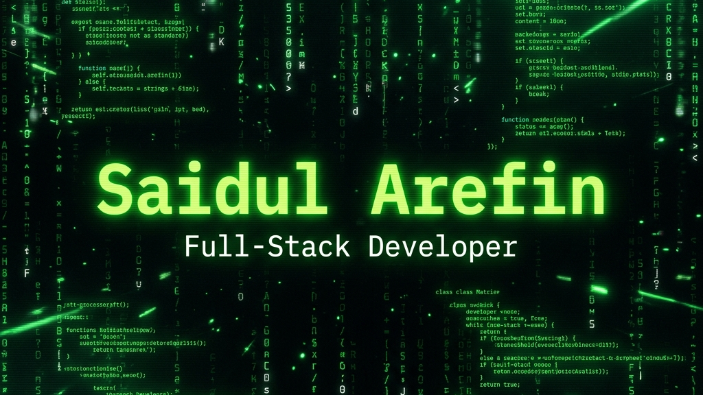

  

 

  

  

    <b>Full-Stack Developer | Rust • Laravel • MERN</b>
  

  

    
    
    
  

---

### 📂 About Me

<table align="center">
  <tr>
    <td width="50%" valign="top">
      <h4>🚀 The Mission</h4>
      I am a highly versatile <b>Full-Stack Developer</b> specializing in the <b>Rust</b>, <b>Laravel</b>, and <b>MERN</b> ecosystems. My passion lies in building high-performance, scalable web applications that deliver exceptional user experiences.
    </td>
    <td width="50%" valign="top">
      <h4>🌍 Location</h4>
      Based in <b>Dhaka, Bangladesh</b>. I am dedicated to clean code, modern architecture, and continuous learning in the ever-evolving tech landscape.
    </td>
  </tr>
</table>

---

### 💻 Core Tech Stack

  

---

### 📊 Professional Metrics

  <table align="center">
    <tr>
      <td>
        
      </td>
      <td>
        
      </td>
    </tr>
  </table>

---

### 🐉 Code Activity

  

 

  

